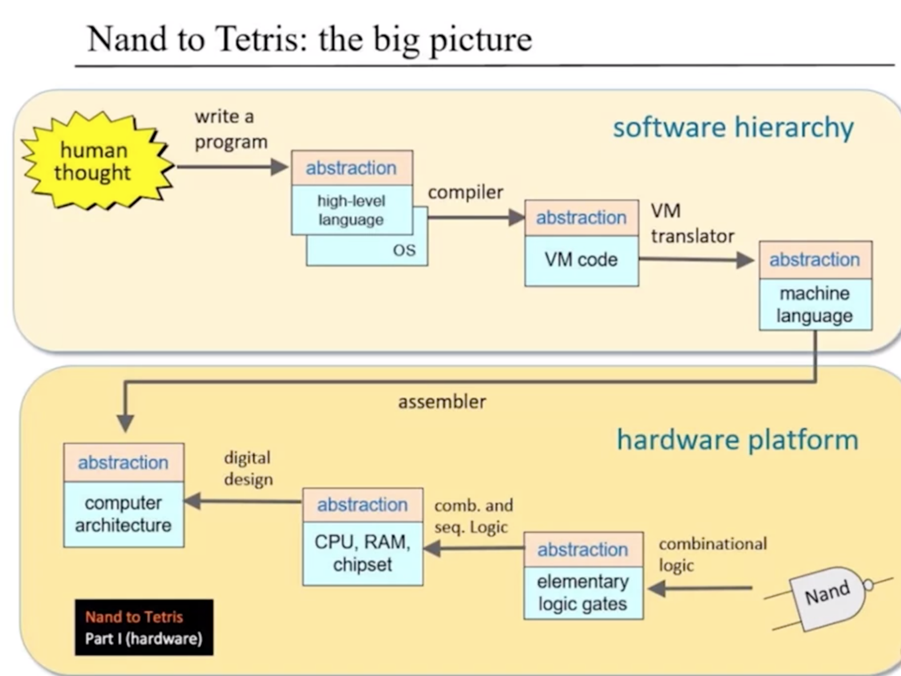
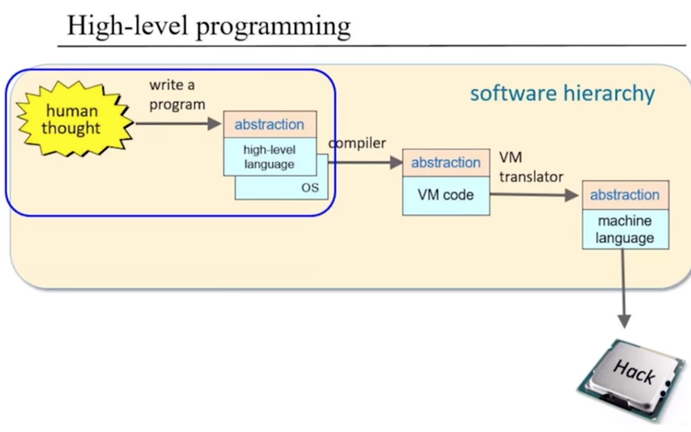

## nand2teris

What is nand2teris?
https://www.nand2tetris.org/

**This is the second part of the nand2teris, the software hierarchy which is more useful for most people.
We treat Hack as a chip executing machine code, don't care the inside of hack.**

You can find all the executable in [release page](https://github.com/Lunaticf/nand2teris/releases)

I strongly suggest learning the part of hardware, which can give you a profound feeling about the underlying things 
and help you to bridge the gap between top and bottom.

Including the hack Assembler in first part, implemented by Java.

- [x] [HackAssembler](https://www.nand2tetris.org/project06)

    Here you can find all the detail about this project and the Binary Code specification.
- [ ] 
